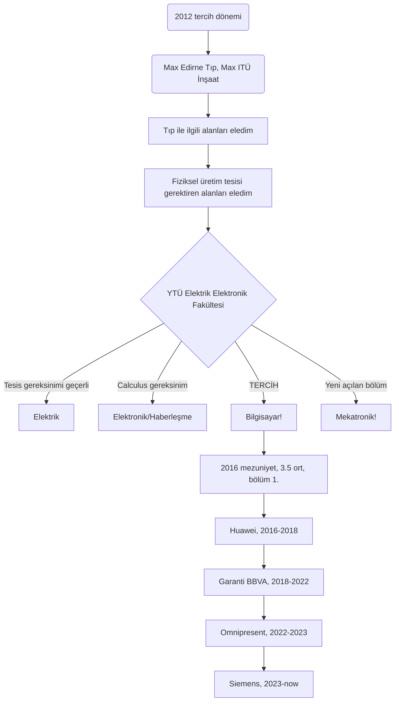

# presentation-for-students

BİLGİSAYAR MÜHENDİSLİĞİ = YAZILIM + DONANIM

1. Sene Dersler

- Bilgisayar Bilimlerine Giriş
- Devre Teorisi
- Mat 1-2
- Fizik 1-2

2. Sene Dersler

- Assembly Dili
- Hesaplama Kuramı
- Ayrık Matematik
- Programlama Dilleri
- Lojik Devreler
- Nesneye Dayalı Kavramlar
- İstatistik
- Sayısal Analiz
- Veri Yapıları Ve Algoritmalar
- Nesneye Dayalı Programlama
- Elektronik Devreler
- Sistem Analizi Ve Tasarımı

3. Sene Dersler

- Mühendislik Matematiği
- Bilgisayar Donanımı
- İşletim Sistemleri
- Algoritma Analizi
- İstatistiksel Veri Analizi
- Sayısal İşaret İşleme
- Mikroişlemci Sistemleri
- Veritabanı Yönetimi
- Yazılım Mühendisliği
- Yöneylem Araştırması
- Biyoenformatiğe Giriş

4. Sene Dersler

- Yapay Zeka
- Dağıtık Sistemler
- Veri İletişimi
- Biçimsel Diller ve Soyut Makineler
- Yapay Sinir Ağlarına Giriş
- Bilgisayar Ağ Teknolojileri
- Gerçek Zamanlı Bilgisayar Sistemleri